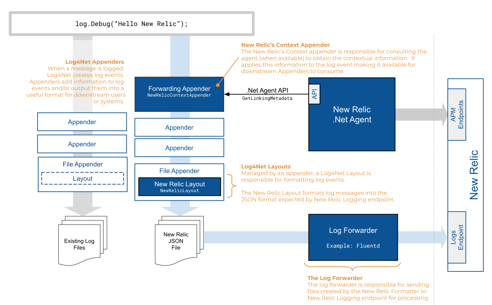

# New Relic .NET Logging Extensions for log4net

The .NET Extensions for log4net will add contextual information from the .NET Agent to Application Log Messages, output them in the New Relic's expected JSON format, and send them to the New Relic Logging endpoint.

## Minimum Requirements

* Microsoft <a target="_blank" href="https://dotnet.microsoft.com/download/dotnet-framework">.NET Framework 4.5+</a> or  <a target="_blank" href="https://dotnet.microsoft.com/download/dotnet-core">.NET Core 2.0+</a>
* <a target="_blank" href="https://docs.newrelic.com/docs/release-notes/agent-release-notes/net-release-notes">New Relic .NET Agent 8.21+<a>
* <a target="_blank" href="https://docs.newrelic.com/docs/agents/net-agent/net-agent-api" target="_blank">New Relic .NET Agent API 8.21+</a>
* <a target="_blank" href="https://logging.apache.org/log4net/">log4net 2.0.8+</a>

### Recommended Components
* <a target="_blank" href="https://www.fluentd.org/download">Fluentd</a> and <a target="_blank" href="https://github.com/newrelic/newrelic-fluentd-output">New Relic's Plugin for Fluentd</a> 


## Overview

```log4net``` uses ```appender``` and ```layout``` to store and format log messages. This project provides ```NewRelicAppender``` which enriches log messages with contextual information from the New Relic .NET Agent if it is attached to your application. This appender will pass enriched log messages to downstream appenders for specific use case log message handle. This project also provides ```NewRelicLayout``` to output log messages in the way required by the New Relic logging endpoint. A target can then be configured to write logging data to an output folder, which can be monitored by a log forwarder to incrementally send log information to New Relic.



### New Relic Appender

The ```NewRelicAppender``` adds contextual information from the .NET Agent (using the API) to the Log Events generated by the application.  This contextual information, known as Linking Metadata, is used by New Relic to link log messages to the transactions and spans from which they were created.  This appender will pass the enriched Log Events to downstream appenders for further processing. Since ```NewRelicAppender``` is a ```ForwardingAppender``` type, it needs to be the first appender in the chain and requires another appender that can write to an actual output destination as its child in order to work.

### New Relic Layout

The ```NewRelicLayout``` formats the enriched Log Events into JSON format expected by New Relic. The appender, which this layout is assigned to, instructs ```log4net``` to output the JSON to a file in the location that the Log Forwarder expects.

### New Relic Log Forwarder

The Log Forwarder monitors an output folder and incrementally sends New Relic formatted Log information to the New Relic Logging Endpoint.  There are many log-forwarders available.  For our examples, we will use <a href="https://www.fluentd.org/" target="_blank">Fluentd</a>.

## Configuration

Configuration of the New Relic extensions for ```log4net``` may be accomplished via ```log4net``` configuration files.  Complete documentation of what ```log4net``` configuration information can be found <a href="http://logging.apache.org/log4net/release/manual/configuration.html" target="_blank">here</a>.

```XML
<log4net>
  <root>
    <level value="ALL" />
    <appender-ref ref="NewRelicAppender" />
  </root>

  <appender name="NewRelicAppender" type="NewRelic.LogEnrichers.Log4Net.NewRelicAppender, NewRelic.LogEnrichers.Log4Net" >
    <threshold value="ALL"/>
    <appender-ref ref="FileAppender" />
  </appender>

  <appender name="FileAppender" type="log4net.Appender.FileAppender">
    <file type="log4net.Util.PatternString" value="%property{NewRelicLogFileName}" />
    <param name="AppendToFile" value="true" />
    <layout type="NewRelic.LogEnrichers.Log4Net.NewRelicLayout, NewRelic.LogEnrichers.Log4Net">
    </layout>
  </appender>
</log4net>
```

### App.config configuration example

The example code below creates a logger based on settings contained in an `App.config` file.

### Sample ```App.config```

```XML
<?xml version="1.0" encoding="utf-8" ?>
<configuration>
  <configSections>
    <section name="log4net" type="log4net.Config.Log4NetConfigurationSectionHandler, log4net"/>
  </configSections>
  <log4net>
    <root>
      <level value="ALL" />
      <appender-ref ref="NewRelicAppender" />
    </root>
    <appender name="NewRelicAppender" type="NewRelic.LogEnrichers.Log4Net.NewRelicAppender, NewRelic.LogEnrichers.Log4Net" >
      <threshold value="ALL"/>
      <appender-ref ref="FileAppender" />
    </appender>
    <appender name="FileAppender" type="log4net.Appender.FileAppender">
      <file type="log4net.Util.PatternString" value="%property{NewRelicLogFileName}" />
      <param name="AppendToFile" value="true" />
      <layout type="NewRelic.LogEnrichers.Log4Net.NewRelicLayout, NewRelic.LogEnrichers.Log4Net">
      </layout>
    </appender>
  </log4net>  
</configuration>
```

## Configuring the Fluentd Log Forwarder

Based on the Fornatter and Sink Configuration described above, the following Fluentd configuration can be used to send logs to New Relic.

```xml
<!--NewRelicLoggingExample.conf-->
<source> 
    @type tail 
    path C:\logs\NLogExample.log.json
    pos_file C:\logs\NLogExample.log.json.pos 
    tag logfile.*
 <parse> 
    @type json 
</parse>
</source>
<match **> 
    @type newrelic 
    license_key <YOUR NEW_RELIC_LICENSE_KEY>
    base_uri https://log-api.newrelic.com/log/v1
</match>
```
