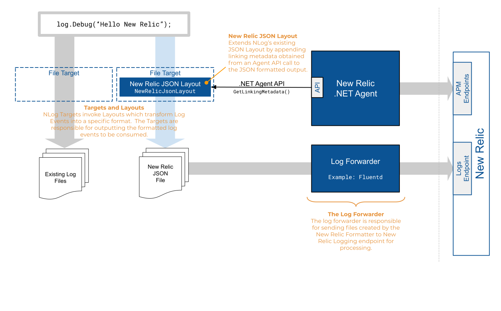

# New Relic .NET Logging Extensions for NLog
The .NET Extensions for NLog will add contextual information from the .NET Agent to Application Log Messages, output them in the New Relic's expected JSON format, and send them to the New Relic Logging endpoint.


## Minimum Requirements

* Microsoft <a target="_blank" href="https://dotnet.microsoft.com/download/dotnet-framework">.NET Framework 4.5+</a> or  <a target="_blank" href="https://dotnet.microsoft.com/download/dotnet-core">.NET Core 2.0+</a>
* <a target="_blank" href="https://docs.newrelic.com/docs/release-notes/agent-release-notes/net-release-notes">New Relic .NET Agent 8.21+<a>
* <a target="_blank" href="https://docs.newrelic.com/docs/agents/net-agent/net-agent-api" target="_blank">New Relic .NET Agent API 8.21+</a>
* <a target="_blank" href="https://nlog-project.org/">NLog 4.5+</a>

### Recommended Components
* <a target="_blank" href="https://www.fluentd.org/download">Fluentd</a> and <a target="_blank" href="https://github.com/newrelic/newrelic-fluentd-output">New Relic's Plugin for Fluentd</a> 


## Overview
NLog works by having Layouts (which guide what data is added to log events and in what format) and Targets (which control where logging data is sent.)  This project provides a ```NewRelicJsonLayout``` which formats a log event in the way required by the New Relic logging endpoint, and adds contextual information from the New Relic .NET Agent if it is attached to your application.  A target can then be configured to write logging data to an output folder, which can be monitored by a log forwarder to incrementally send log information to New Relic.



### New Relic JSON Layout
The ```NewRelicJsonLayout``` adds contextual information from the .NET Agent (using the API) to the Log Events generated by the application.  This contextual information, known as Linking Metadata, is used by New Relic to link log messages to the transactions and spans from which they were created.  Additionally, the layout translates enriched Log Events into the JSON format expected by New Relic.

### New Relic Log Forwarder
The Log Forwarder monitors an output folder and incrementally sends New Relic formatted Log information to the New Relic Logging Endpoint.  There are many log-forwarders available.  For our examples, we will use <a href="https://www.fluentd.org/" target="_blank">Fluentd</a>.

## Configuration

### Configuring the New Relic Layout
Configure the ```NewRelicJsonLayout``` by adding it to the NLog configuration as described below.  There are no configuration options for the ```NewRelicJsonLayout```.
```csharp

  var loggerConfig = new LoggingConfiguration();
  
  var newRelicFileTarget = new FileTarget("NewRelicFileTarget");
  
  newRelicFileTarget.Layout = new NewRelicJsonLayout();
  newRelicFileTarget.FileName = "log/folder/path/NewRelicLogging.json";
  
  loggerConfig.AddTarget(newRelicFileTarget);
  loggerConfig.AddRuleForAllLevels("NewRelicFileTarget");
  
  LogManager.Configuration = loggerConfig;
  
  var logger = LogManager.GetLogger("Example");

```

The ```NewRelicJsonLayout``` includes a default set of attributes.  You can add additional attributes if desired:

```csharp
  var nrLayout = new NewRelicJsonLayout();
  
  nrLayout.Attributes.Add("line.number", "${callsite-linenumber}", true));
  // Add layout to target
```
<br/>

In order to send the output of the ```NewRelicJsonLayout``` to the New Relic logging endpoint, it needs to be written to disk so that a log forwarder, e.g. Fluentd, can be configured to send it to New Relic.  Since the JSON files are written to disk, some of these <a href="https://github.com/nlog/NLog/wiki/File-target" target="_blank">configuration options</a> may be useful in managing the amount of disk space used and/or the performance of the Target.

* ```archiveAboveSize```
* ```maxArchiveFiles```
* ```bufferSize```
* ```enableArchiveFileCompression```
* ```autoFlush```
* ```concurrentWrites```

Though not required, using the <a href="https://github.com/nlog/NLog/wiki/AsyncWrapper-target" target="_blank">NLog AsyncWrapper Target</a> may help improve the performance by performing asynchronous, buffered execution of target writes.
<br/>

### Configuring the Fluentd Log Forwarder
Based on the Fornatter and Sink Configuration described above, the following Fluentd configuration can be used to send logs to New Relic.


```xml
<!--NewRelicLoggingExample.conf-->
<source> 
    @type tail 
    path C:\logs\NLogExample.log.json
    pos_file C:\logs\NLogExample.log.json.pos 
    tag logfile.*
 <parse> 
    @type json 
</parse>
</source>
<match **> 
    @type newrelic 
    license_key <YOUR NEW_RELIC_LICENSE_KEY>
    base_uri https://log-api.newrelic.com/log/v1
</match>
```

<br/>

### Applying Context to Log Events

#### Automatic Properties
In addition to the linking metadata obtained from the .NET Agent, the ```NewRelicJsonLayout``` automatically adds the following properties, if applicable, to each ```LogEvent```.

* Timestamp
* Message Text
* Message Template
* Log Level
* Logger Name
* Thread Id
* Activity Id
* Process Id
* Error Message
* Error Class
* Error Stack Trace
<br/>

#### Custom Message Properties
The ```NewRelicJsonLayout``` automatically includes all custom properties added to log events in its outout.  These properties are visible in New Relic Logging under the "Message Properties" section.  NLog supports <a href="https://github.com/NLog/NLog/wiki/Context" target="_blank">several methods of adding custom properties</a>.  Note that the ```NewRelicJsonLayout``` does _not_ include custom properties from the ```MappedDiagnosticsContext```, ```MappedDiagnosticsLogicalContext```, or ```GlobalDiagnosticsContext```.

For example, the following log message template will result in the custom properties of ```FirstName``` and ```nbr``` being included in the output nested under the "Message Properties" key.

```csharp
    logger.Debug("Hello {FirstName}, you are number {nbr} on my list", "Bob", 32);
```
<br/>

## File-based Configuration
Configuration of the New Relic extensions for NLog may be accomplished with file based configuration providers.  Complete documentation of what files NLog searches for configuration information can be found <a href="https://github.com/nlog/nlog/wiki/Configuration-file#configuration-file-locations" target="_blank">here</a>.

### App.config configuration example
The example code below creates a logger based on settings contained in an `App.config` file.

### Sample Code
```CSharp
var logger = LogManager.GetLogger("NewRelicLog");
logger.Info("Hello, New Relic!");
```

### Sample ```App.config```
```XML
<?xml version="1.0" encoding="utf-8" ?>
<configuration>
  <configSections>
    <section name="nlog" type="NLog.Config.ConfigSectionHandler, NLog"/>
  </configSections>
  <startup>
    <supportedRuntime version="v4.0" sku=".NETFramework,Version=v4.5" />
  </startup>
  <nlog xmlns="http://www.nlog-project.org/schemas/NLog.xsd"
      xmlns:xsi="http://www.w3.org/2001/XMLSchema-instance">
    <extensions>
      <add assembly="NewRelic.LogEnrichers.NLog" />
    </extensions>
    <targets>
      <target name="NewRelicLogFile" xsi:type="File" fileName="C:/path/to/NewRelicLog.json">
        <layout xsi:type="newrelic-jsonlayout">
        </layout>
      </target>
    </targets>
    <rules>
      <logger name="NewRelicLog" minlevel="Info" writeTo="newRelicLogFile" />
    </rules>
  </nlog>
</configuration>
```
